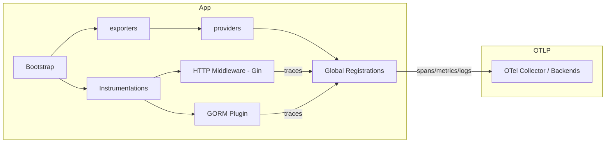

# Observability (instrumentação e exportação)

Este diretório contém utilitários para instrumentação observability (traces, metrics, logs) usando OpenTelemetry e integrações comuns (Gin, GORM).

**Resumo:**
- **O que é:** conjunto de helpers para criar exporters OTLP (ou noop), providers (tracer, meter, logger), middlewares para Gin e plugin para GORM.
- **O que faz:** configura recursos (service name/version), cria exporters a partir de variáveis de ambiente, registra providers globais e fornece middlewares/plugins para instrumentar requests e queries.

## Estrutura
- `adapters/` — implementações concretas para criar exporters/providers e helpers (tracer, metric, logger, config e redirection).
- `http_middlewares/` — middlewares para Gin (instrumentação de requests).
- `gorm_plugins/` — plugin para GORM que ativa instrumentação OpenTelemetry em queries.

Arquivos principais:
- [providers/otlp_resource.go](providers/otlp_resource.go) — cria `Resource` baseado em `SERVICE_NAME` e `SERVICE_VERSION`.
-- NOTE: concrete implementations live under `internal/observability/adapters/` in this repository (see `adapters/otlp_tracer.go`, `adapters/otlp_metric.go`, `adapters/otlp_logger.go`, `adapters/otlp_config.go`, `adapters/log_redirect.go`).

## Como usar

1) Configure variáveis de ambiente (opcionais):

```bash
SERVICE_NAME=my-service
SERVICE_VERSION=1.2.3
OTLP_ENDPOINT=otel-collector:4317 # se vazio, exporters retornam noop
```

2) Inicialize exporters e providers no bootstrap da aplicação:

```go
ctx := context.Background()

// criar provider/exporter a partir do ambiente (ou noop se não configurado)
tp, err := adapters.NewOTLPTracerFromEnv(ctx)
if err != nil {
  // tratar erro
}
defer func() {
  if tp != nil {
    tp.Shutdown(ctx)
  }
}()

mp, _ := adapters.NewOTLPMetricFromEnv(ctx)
defer func() {
  if mp != nil {
    mp.Shutdown(ctx)
  }
}()
```

3) Registrar middlewares e plugins:

```go
r := gin.New()
// middleware de tracing para requests HTTP
r.Use(middlewares.OtelGinMiddleware())

// ao criar DB (GORM)
// db, _ := gorm.Open(sqlite.Open(...))
// plugin, _ := adapters.NewOtelGormPlugin()
// db.Use(plugin)
```

## Arquitetura (diagrama)



Descrição do diagrama:
- `exporters` encapsula criação de clientes OTLP (gRPC) e devolve um Exporter ou um noop quando não configurado.
- `providers` cria e registra globalmente `TracerProvider`, `MeterProvider` e `LoggerProvider` usando o `Resource` (service name/version).
- Instrumentações (middlewares e plugins) geram spans/metrics que são processados pelos providers e enviados pelos exporters para o `OTel Collector`.

## Boas práticas e documentação adicional
- Centralize a inicialização no bootstrap da aplicação e exponha funções de shutdown para fechar buffers.
- Garanta que `OTLP_ENDPOINT` esteja protegido em produção e que o collector aceite conexões.
- Documente no README da sua aplicação principal (`README.md`) como ativar observability, quais variáveis ajustar e como inspecionar traces no backend (Jaeger, Tempo, New Relic, etc.).

## Testes
- Os arquivos `*_test.go` presentes na pasta `providers` e `exporters` mostram como os exporters/noop são usados em testes. Verifique os testes para exemplos de uso e substituição por noop em CI.

## Próximos passos sugeridos
- Adicionar exemplos de inicialização em `cmd/` ou `examples/` para criar um guia rápido.
- Documentar configurações adicionais (headers, autenticação OTLP, TLS).

---
Gerado automaticamente com base nos arquivos do diretório `internal/observability`.
