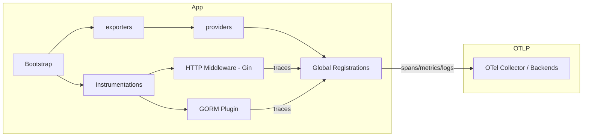

# Observability (instrumentação e exportação)

Este diretório contém utilitários para instrumentação observability (traces, metrics, logs) usando OpenTelemetry e integrações comuns (Gin, GORM).

**Resumo:**
- **O que é:** conjunto de helpers para criar exporters OTLP (ou noop), providers (tracer, meter, logger), middlewares para Gin e plugin para GORM.
- **O que faz:** configura recursos (service name/version), cria exporters a partir de variáveis de ambiente, registra providers globais e fornece middlewares/plugins para instrumentar requests e queries.

## Estrutura
- `exporters/` — cria exporters OTLP (traces, metrics, logger) ou noop se `OTLP_ENDPOINT` estiver vazio. Veja [exporters](exporters/).
- `providers/` — cria `TracerProvider`, `MeterProvider`, `LoggerProvider` e o `Resource` com `SERVICE_NAME`/`SERVICE_VERSION`. Veja [providers](providers/).
- `http_middlewares/` — middlewares para Gin (instrumentação de requests). Veja [http_middlewares](http_middlewares/).
- `gorm_plugins/` — plugin para GORM que ativa instrumentação OpenTelemetry em queries. Veja [gorm_plugins](gorm_plugins/).

Arquivos principais:
- [providers/otlp_resource.go](providers/otlp_resource.go) — cria `Resource` baseado em `SERVICE_NAME` e `SERVICE_VERSION`.
- [providers/otlp_tracer_provider.go](providers/otlp_tracer_provider.go) — `NewOTLPTracerProvider(ctx, exporter)` registra `otel.SetTracerProvider(...)` e retorna `shutdown`.
- [providers/otlp_metric_provider.go](providers/otlp_metric_provider.go) — `NewOTLPMetricProvider(ctx, exporter)` registra `otel.SetMeterProvider(...)`.
- [providers/otlp_logger_provider.go](providers/otlp_logger_provider.go) — `NewOTLPLoggerProvider(ctx, exporter)` registra provider de logs.
- [exporters/otlp_tracer_exporter.go](exporters/otlp_tracer_exporter.go) — cria `otlptracegrpc` exporter ou noop quando `OTLP_ENDPOINT` vazio.
- [http_middlewares/otlp_tracer_gin_middleware.go](http_middlewares/otlp_tracer_gin_middleware.go) — `TracingMiddleware()` usando `otelgin.Middleware(providers.GetServiceName())`.
- [gorm_plugins/otelgorm_plugin.go](gorm_plugins/otelgorm_plugin.go) — `NewOtelGormPlugin()` retorna plugin GORM de tracing.

## Como usar

1) Configure variáveis de ambiente (opcionais):

```bash
SERVICE_NAME=my-service
SERVICE_VERSION=1.2.3
OTLP_ENDPOINT=otel-collector:4317 # se vazio, exporters retornam noop
```

2) Inicialize exporters e providers no bootstrap da aplicação:

```go
ctx := context.Background()

// criar exporter (ou noop se OTLP_ENDPOINT não configurado)
spanExporter, err := exporters.NewOTLPTracerExporter(ctx)
if err != nil {
    // tratar erro
}

tp, tpShutdown, err := providers.NewOTLPTracerProvider(ctx, spanExporter)
// lembrar de chamar tpShutdown(ctx) na finalização

metricExporter, _ := exporters.NewOTLPMetricExporter(ctx)
mp, mpShutdown, _ := providers.NewOTLPMetricProvider(ctx, metricExporter)

// opcional: logger provider
// loggerExporter := exporters.NewOTLPLoggerExporter(ctx) // se existir
// lp, lpShutdown, _ := providers.NewOTLPLoggerProvider(ctx, loggerExporter)

defer tpShutdown(ctx)
defer mpShutdown(ctx)
```

3) Registrar middlewares e plugins:

```go
r := gin.New()
// middleware de tracing para requests HTTP
r.Use(middlewares.TracingMiddleware())

// ao criar DB (GORM)
// db, _ := gorm.Open(sqlite.Open(...))
// plugin, _ := adapters.NewOtelGormPlugin()
// db.Use(plugin)
```

## Arquitetura (diagrama)



Descrição do diagrama:
- `exporters` encapsula criação de clientes OTLP (gRPC) e devolve um Exporter ou um noop quando não configurado.
- `providers` cria e registra globalmente `TracerProvider`, `MeterProvider` e `LoggerProvider` usando o `Resource` (service name/version).
- Instrumentações (middlewares e plugins) geram spans/metrics que são processados pelos providers e enviados pelos exporters para o `OTel Collector`.

## Boas práticas e documentação adicional
- Centralize a inicialização no bootstrap da aplicação e exponha funções de shutdown para fechar buffers.
- Garanta que `OTLP_ENDPOINT` esteja protegido em produção e que o collector aceite conexões.
- Documente no README da sua aplicação principal (`README.md`) como ativar observability, quais variáveis ajustar e como inspecionar traces no backend (Jaeger, Tempo, New Relic, etc.).

## Testes
- Os arquivos `*_test.go` presentes na pasta `providers` e `exporters` mostram como os exporters/noop são usados em testes. Verifique os testes para exemplos de uso e substituição por noop em CI.

## Próximos passos sugeridos
- Adicionar exemplos de inicialização em `cmd/` ou `examples/` para criar um guia rápido.
- Documentar configurações adicionais (headers, autenticação OTLP, TLS).

---
Gerado automaticamente com base nos arquivos do diretório `internal/observability`.
