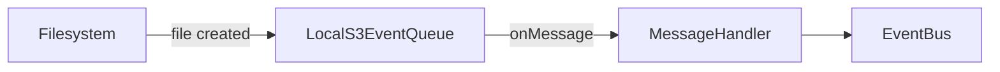

# pkg/message

Contratos e adapters de mensageria fornecidos pelo projeto.

Resumo
- Expõe `NewLocalS3EventQueue(ctx, storagePath, filePath)` que retorna um
  `MessageQueueAdapter` (interface). O adapter local observa um diretório e
  emite eventos S3 simulados.

Arquitetura



Uso (exemplo)

```go
package main

import (
    "context"
    "fmt"
    "os"
    "path/filepath"

    "github.com/brunojet/go-infra-backend/pkg/message"
)

func main() {
    tmp := os.TempDir()
    storagePath := filepath.Join(tmp, "my-bucket")
    adapter, err := message.NewLocalS3EventQueue(context.Background(), storagePath, "unsigned")
    if err != nil {
        panic(err)
    }
    stop := adapter.Start(func(evt any) {
        fmt.Println("recebido:", evt)
    })
    defer stop()
    select {}
}
```

Notas
- `storagePath` deve ser um caminho absoluto para o diretório que representa o
  bucket (o código do adapter exige isso). O `filePath` é relativo dentro do
  bucket.
